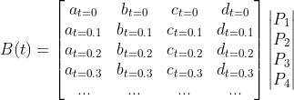

# VVGL Player

WebGL Player for VVID files

VVGL is a WebGL based rendering engine for LRN files. This should be considered an alternative rendering engine to SVG, one of the major components of vv.js.

## Getting started

VVGL uses a node, webpack build environment. Make sure Node, Webpack, Yarn etc... are all installed

**Install dependencies**

    npm install

**data.json**

You need a specially formatted JSON file. One is already included in the vvid folder, and you can generate more from src/encoder.js, which takes in the outputs from vectorization, and outputs a data.json file

*Run demo file*

    yarn JSONFILE=vvid/data.json demo:serve

## Background

**WebGL**
To understand the VVGL player, you'll need to learn the fundamentals of WebGL.  [WebGL Fundamentals](https://webglfundamentals.org/) has a great introduction to WebGL. In addition, [Khronos.org](https://www.khronos.org/opengl/wiki) and [Mozilla Developer Network](https://developer.mozilla.org/en-US/docs/Web/API/WebGL_API/) are good references for OpenGL, and the WebGL API respectively.

**Bezier curves**
On top of WebGL, it's critical that you understand Bezier curves (and specifically Cubic Bezier curves). There is a good animation [here](https://www.jasondavies.com/animated-bezier/), a few [videos](https://www.youtube.com/watch?v=pnYccz1Ha34).

**Linear Algebra**
It's also helpful to have a background in basic linear algebra, and specifically vector and matrix multiplication.

## Theory

To understand how the WebGL player works at a theory level, you only need to know two things:

* How to render a bezier curve using linear algebra
* How to render complex polygons as a series of triangles

**Bezier Curves as Linear Algebra**

The formula for a cubic Bezier curve is as follows

You can substitute the t-values with easier to read variables

The bezier curve equation then becomes

Of course, a,b,c,d are still functions of t, but they now look more like linear algebra equations.

You can now treat the bezier equation as matrix multiplication, as below

Of course, while the points are actual numbers, a,b,c,d are just functions of t. The key here is to now evaluate a,b,c and d for different values of t, from 0 to 1

Here, each value in the matrices is now a concrete number. To be even more explicit, the equation B(t) now results in a vector of the different points along the bezier curve

Finally, remember that a, b, c and d are just functions of t, and aren't dependent on the control points. The a,b,c,d matrix therefore doesn't change between bezier curves, and you can therefore consider it a constant

Every bezier curve, therefore, can be calculated by multiplying the 4 control points by a constant matrix T

## Implementation

## Issues

https://github.com/Vectorly/web-gl-experiments/tree/master/full_frame_holes