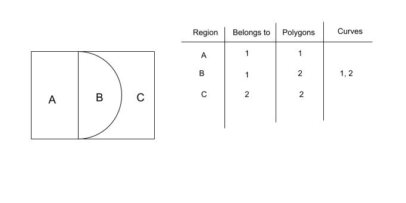

# VVGL Player

WebGL Player for VVID files

VVGL is a WebGL based rendering engine for LRN files. This should be considered an alternative rendering engine to SVG, one of the major components of vv.js.

## Getting started

VVGL uses a node, webpack build environment. Make sure Node, Webpack, Yarn etc... are all installed

**Install dependencies**

    npm install

**data.json**

You need a specially formatted JSON file. One is already included in the vvid folder, and you can generate more from src/encoder.js, which takes in the outputs from vectorization, and outputs a data.json file

*Run demo file*

    yarn JSONFILE=vvid/data.json demo:serve

## Background

**WebGL**
To understand the VVGL player, you'll need to learn the fundamentals of WebGL.  [WebGL Fundamentals](https://webglfundamentals.org/) has a great introduction to WebGL. In addition, [Khronos.org](https://www.khronos.org/opengl/wiki) and [Mozilla Developer Network](https://developer.mozilla.org/en-US/docs/Web/API/WebGL_API/) are good references for OpenGL, and the WebGL API respectively.

**Bezier curves**
On top of WebGL, it's critical that you understand Bezier curves (and specifically Cubic Bezier curves). There is a good animation [here](https://www.jasondavies.com/animated-bezier/), a few [videos](https://www.youtube.com/watch?v=pnYccz1Ha34).

**Linear Algebra**
It's also helpful to have a background in basic linear algebra, and specifically vector and matrix multiplication.

## Theory

To understand how the WebGL player works at a theory level, you need to know:

* How to render a bezier curve using linear algebra
* How to draw arbitrary polygons as a series of triangles
* How to construct complex shapes as a superposition of polygons and bezier curves
* How to cancel out shape interference through bitwise inversions

**Bezier Curves as Linear Algebra**

The formula for a cubic Bezier curve is as follows

You can substitute the t-values with easier to read variables

The bezier curve equation then becomes

Of course, a,b,c,d are still functions of t, but they now look more like linear algebra equations.

You can now treat the bezier equation as matrix multiplication, as below

Of course, while the points are actual numbers, a,b,c,d are just functions of t. The key here is to now evaluate a,b,c and d for different values of t, from 0 to 1

Here, each value in the matrices is now a concrete number. To be even more explicit, the equation B(t) now results in a vector of the different points along the bezier curve

Finally, remember that a, b, c and d are just functions of t, and aren't dependent on the control points. The a,b,c,d matrix therefore doesn't change between bezier curves, and you can therefore consider it a constant

Every bezier curve, therefore, can be calculated by multiplying the 4 control points by a constant matrix T

In this way, you can feed hundreds of thousands of bezier curves to the GPU in parallel, and it will output millions of vertex points efficiently (in less than 1 ms), becuase it's just about multiplying 10^5 vectors by a constant matrix

**Drawing abritrary polygons using Triangles**

WebGL and OpenGL only really understand lines and triangles. Everything that is rendered in WebGL therefore needs to be broken down into triangles.

The obvious solution is to use triangulation, and there are [libraries](https://github.com/mapbox/earcut) which can triangulate large polygons efficiently. These algorithms use the CPU however, and the runtime for thousands of objects (as in a typical animated scene) ends up being ~30ms per frame

The non-obvious solution is to use a neat feature of geometry theory: For any arbitrary polygon, if you draw a [triangle fan](https://en.wikipedia.org/wiki/Triangle_fan), that is - the series of triangles made by connecting a vertex to every subsequent pair of vertices (as shown below)

where the triangles in triangle fan are 1-2-3, 1-3-4, 1-4-5, 1-5-6 and 1-6-7, the areas inside the polygon will be covered by an odd number of triangles. The areas outside the polygon will be covered by an even number of triangles.

This neat quirk lets you take advantage of 2 OpenGL/WebGL features to draw any closed 2d shape:
* Triangle Fans
* Stencil Buffers

For the stencil buffer, you can use the stencil mask function to mark any pixel with an 8-bit id without actually drawing the pixel. You can also use the stencil INVERT function to do a bitwise flip of the pixel's 8-bit id, and the stencil test to draw only draw triangles on pixels where the 8-bit id is equal to a certain value.

What you can do therefore, is to draw a triangle fan for every polygon, using the stencil mask to set the pixels to a given id, and the stencil invert function to flip the pixel ids every time a triangle is drawn. Because of the neat quirk mentioned above, every pixel inside the polygon will have a common 8-bit id, and everything outside the polygon will remain unaffected, because they will have undergone an even number of inverts.

This idea comes from the [GL Programming textbook](http://www.glprogramming.com/red/chapter14.html#name13), which you can look at for reference.

**Shapes as superpositions of polygons and bezier curves**

Let's say you define a shape as a string of bezier curves. Here, we outline how to construct that shape as a superposition of independent bezier curves, and the polygon formed by the bezier-curve end points.

Consider the shape shown above, which is constructed of 2 lines and 2 bezier curves. Here, we would form a polygon from the 4 bezier curve end points, which we call the 'coarse polygon'.

Using the technique for drawing arbitrary polygons in the previous section, you can easily render the coarse polygon.

Using the linear algebra technique mentioned above, you can also render each bezier curve independantly.

With the rendered curves and the rendered polygon, you have all the triangles needed to build the shape. Constructing the shape isn't just a matter of adding the bezier curves to the coarse polygon though. Some curves 'cut into' the polygon (i.e. they are concave). To properly build the shape, you effectively do a bitwise 'or' operation on the rendered bezier curves and coarse polygon, only painting areas which are either in the polygon or in a curve, but not areas that are both in the polygon and in a curve, as seen below.

Fortunately, the stencil buffer functionality of OpenGL  / WebGL enable exactly these kinds of 'bitwise' operations, enabling construction of any closed shape defined as a series of bezier curves, no matter how abritrarily complex.

**Cancelling out shape interference**

If you only needed to render one shape, the above techniques would be sufficient to build any possible closed bezier path in WebGL. When you involve multiple shapes though, especially shapes which are adjacent, a naïve implementaiton of the above would result in shape interference, with neighboring shapes painting over each other.

To see why, consider the following example:

If you follow the theory mentioned in the previous sections, you can construct a coarse polygon and bezier curve for each shape

When you combine them using the inverse function, and a constant stencil mask, you will run into interference. Consider what happens when you draw both shapes in sequence, using the invert method

The green polygon inverts the bezier curve of the blue polygon, setting it back to zero, and freeing the space to be painted by the green bezier curve

The solution is to assign each shape an id. You want curves and polygons of the same shape to cancel each other out, without affecting the curves or polygons of other shapes, as in the diagram below.

This can be done in OpenGL using the stencil function, and in actual code it looks something like this:

    gl.stencilFunc(gl.ALWAYS, 0xff , 0xff);
    gl.stencilOp( gl.KEEP,  gl.KEEP, gl.INVERT);
    gl.stencilMask(i);

The first line specifies that the stencil function will run on every pixel on the polygon (equivalent to if(true)). The second line says that if a pixel meets the condition in the stencil function (which is set to alway true), then do an INVERT operation. What the invert operation does is to take a bitwise inverse of the stencil_mask*the pixel's current 8-bit stencil id.

For illustration, consider a pixel which starts out with a stencil id of 0 (the default). It's 8-bit id is

    00000000

When you set the stencil mask to 1, the stencil mask is another 8-bit number

    00000001

When you do an INVERT operation on th pixel's stencil id, it does a bitwise flip of each bit, but only on the bits where the stencil mask is 1. Here, since the stencil mask is 00000001, where only the first bit is 1, only the first bit of the pixel value will get flipped.

    00000001

Therefore, inverting a pixel whose 8-bit value is 0 by stencil mask will set the value of the bit equal to the stencil mask.

The key here is to realize that you can invert non-zero values as well. Here, we will spell out exactly what happens when you invert a pixel in Region b in the example above, first by Polygon 2, then By curve 1, and then by Curve 2

    Starting pixel id:  00000000
    Invert by polygon 2 (mask=00000010):  00000010
    Invert by curve   1 (mask=00000001):  00000011
    Invert by curve   2 (mask=00000010):  00000001

As you can see, the bit-value of region B is now equal to 1. If you only paint shape 1 in areas where the id is equal to 1, and only paint shape 2 in areas where the id is equal to 2, you will get the correct figure, regardless of the order in which the shapes are painted.

You can formally prove that this technique works even for particularly complex, overlapping, nested and intertwined shapes, as long as each shape's id is uninque.

In code, this manifests itself in the following block of semi-pseudocode:

            gl.stencilFunc(gl.ALWAYS, id , 0xff);
            gl.stencilMask(id);
            gl.colorMask(false, false, false, false);

            drawPolygons();
            drawCurves();

            gl.stencilFunc(gl.EQUAL, id , 0xff);
            gl.stencilMask(id);
            gl.colorMask(true, true, true, true);

            drawPolygons();
            drawCurves();

The only issue with this algorithm is that GPUs are limited to 8-bit buffers, so you cannot have more than 255 shape ids. The solution here is assign each shape an id between 1 and 255, and use shear probability to minimize shapes with the same id being next to each other. This is what the buckets function does, where shapes are bunched together in buckets, where each shape in a single bucket has the same 8-bit id.

**Contours**

One last point to mention: Each shape can have holes inside. For the inversion technique to work, interior holes of each shape need to be drawn. This technically means that a shape can have more than one path or outline. This is what contours are: Each shape is defined not by one singular path, but by one or more contours. You don't need to make a distinction between internal or external contours.  If every contour is drawn, then the above theory will ensure that internal holes will be properly carved out of any shape, resulting in the correct output and leaving any shapes within the holes unaffected, regardless of paint order.

## Implementation

To implement the theory above, there are some specific functions of WebGL to make sure to understand

**Instanced Arrays**

As discussed in the theory section, each bezier curve is just a constant matrix times the control points of the bezier curve. To efficiently draw this in WebGL, we use [Instanced Arrays](https://developer.mozilla.org/en-US/docs/Web/API/ANGLE_instanced_arrays), which can apply the same T value matrix to every bezier curve. To do this, you need to use the vertexAttribDivisor method to specify that the bezier curve parameters advance 1 per cycle of the t_array.

**Primitive restarts**

If you draw each polygon using 1 draw call, you will end up making thousands of draw calls per frame, which adds up to quite a bit of CPU and GPU usage. To solve this problem, we use primitive restarts, whereby if you use an index array as-in [drawElements](https://developer.mozilla.org/en-US/docs/Web/API/WebGLRenderingContext/drawElements), if you set an index value to the maximum allowed value (0xffff for 16-bit arrays), then the draw-sequence will interrupt the current polygon/triangle fan, and start drawing the next shape from the next index.

This is only available in WebGL2, so it is only enabled when WebGL 2 is available.

**WebGL2**

Because of the primitive restarts feature, we try to use WebGL2 if it is availble, as it enables 60 fps with less than 5% CPU usage, compared to 15% CPU usage when primitive restart isn't available. Most of the code is the same, but you will see sections of code which depend on whether webGL1 or WebGL2 is being used.

**Stencil**

By theoretically, you might have gotten that things are being drawn in more than 2 draw calls. One of the major downsides of using the stencil-invert technique is shape interference, which happens when the different triangle fans of different shapes start to paint over each other.

The way around this is to use the stencil mask function, and draw different shapes using different stencil mask values (can be anything from 0 to 255). This prevents shape interference at the cost of requiring more draw calls.

For efficiency, we randomly assign shapes into stencil 'buckets', so that each shape in a bucket is drawn with a single stencil mask value.

You can therefore decide how many different stencil masks you want: If you do 255, every scene will require 510 draw calls. If you chose 20, every scene will have 40 draw calls. Shape interference seems to become minimal at around 100 stencil buckets. You can visualize interference by changing the "num_buckets" variable in the setBezierTexture function

## Results

https://files.vectorly.io/demo/webgl-player/5/index.html

## Future work

There are still some key improvements we can make

* Do an audit of the current code to make it more efficient and reduce CPU usage below 5%
* Don't repaint the full scene on every frame, to make it more efficient for rendering at high resolutions
* Use WebAssembly and/or Webworkers to improve the efficiency of the code
* Build a new efficient file format